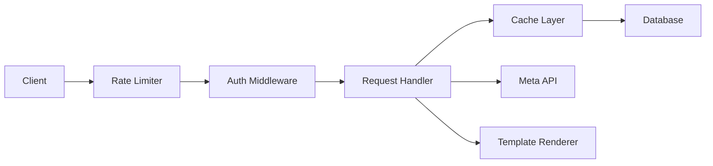

# Social Media Admin Dashboard - Technical Manual

## System Architecture

### Core Components
1. **Backend (Go)**
   - HTTP Server
   - Database Layer (PostgreSQL)
   - Authentication System (JWT)
   - Template Rendering
   - Real-time Updates (Supabase planned)
   - Rate Limiting
   - Caching Layer

2. **Frontend**
   - HTMX for dynamic updates
   - Alpine.js for interactive components
   - Tailwind CSS for styling
   - Hyperscript for additional interactivity

### Data Flow


## Core Components Deep Dive

### 1. Authentication System
- Located in `pkg/auth/`
- Uses JWT tokens with 24-hour expiration
- Key files:
  - `jwt.go`: Token generation and validation
  - `middleware.go`: Auth middleware for protected routes
  - `authenticator.go`: Main auth service

```go
type Claims struct {
    UserID    string
    ClientID  string
    Role      string
    jwt.RegisteredClaims
}
```

### 2. Database Layer
- PostgreSQL with `database/sql`
- Key components:
  - `db/database.go`: Core DB setup
  - `db/queries.go`: SQL queries
  - `db/helpers.go`: Query helpers and utilities

#### Important Tables
- messages
- conversations
- social_pages
- users
- clients

### 3. Caching System
- In-memory caching with TTL
- Located in `pkg/cache/cache.go`
- Handles:
  - Message lists
  - Profile pictures
  - Thread information

```go
type Cache struct {
    items map[string]CacheItem
    mu    sync.RWMutex
}
```

### 4. Rate Limiting
- IP-based rate limiting
- Different limits for views vs messages
- Located in `handlers/rate_limiters.go`

```go
type RateLimiter struct {
    MessageLimit *IPRateLimiter  // 300/minute
    ViewLimit    *IPRateLimiter  // 1200/minute
}
```

### 5. Message Handling System

#### Message Service (`services/message_service.go`)
- Handles message operations
- Integrates with cache
- Manages pagination
- Handles real-time updates

#### Key Operations:
1. Fetching Messages
2. Sending Messages
3. Thread Management
4. Profile Picture Management

### 6. Meta API Integration
- Located in `pkg/meta/`
- Handles both Facebook and Instagram
- Profile picture fetching
- Message sending/receiving

## Key Processes

### 1. Message Flow
1. Request hits rate limiter
2. Authentication check
3. Check cache for data
4. If cache miss, query database
5. Update cache
6. Render template
7. Send response

### 2. Profile Picture Updates
```go
// Process:
1. Check if refresh needed
2. Fetch from Meta API
3. Update database
4. Update cache
5. Trigger UI update
```

### 3. Real-time Updates (Planned)
- Supabase integration planned
- Located in `pkg/realtime/supabase.go`
- Will handle live message updates

## Template System

### Structure
- `templates/layout.html`: Base template
- `templates/components/`: Reusable components
- `templates/messages.html`: Main message view
- `templates/login.html`: Authentication view

### Template Functions
```go
funcMap := template.FuncMap{
    "reverse": func(messages []models.Message) []models.Message {
        // Reverses message order for display
    },
}
```

## Error Handling

### Error Types (`pkg/errors/errors.go`)
```go
type ErrorCode string

const (
    ErrNotFound   ErrorCode = "NOT_FOUND"
    ErrForbidden  ErrorCode = "FORBIDDEN"
    ErrValidation ErrorCode = "VALIDATION"
)
```

## Configuration

### Environment Variables
Required variables:
- `DATABASE_URL`
- `JWT_SECRET`
- `META_API_KEY`
- `PORT` (default: 8080)

### Config Structure (`config/config.go`)
```go
type Config struct {
    Database DatabaseConfig
    Auth     AuthConfig
    Meta     MetaConfig
    Server   ServerConfig
    Messages MessagesConfig
}
```

## Development Notes

### Rate Limits
- Development: 300/minute for messages, 1200/minute for views
- Production: Should be adjusted based on load

### Cache TTL
- Default: 5 minutes
- Configurable via `MessagesConfig.CacheTimeout`

### Profile Picture Refresh
- Manual refresh: `curl -X POST http://localhost:8080/refresh-profile-pictures`
- Automatic refresh on expired URLs

### Database Queries
- Use prepared statements
- Pagination implemented
- Efficient joins for message fetching

## Testing

### Test Data
- Test threads use prefix: `thread_`
- Default avatar: `/static/default-avatar.png`

### Profile Picture Testing
```bash
curl -X POST http://localhost:8080/refresh-profile-pictures
```

## Security Considerations

1. **JWT Security**
   - 24-hour expiration
   - Secure cookie settings
   - HTTPS required in production

2. **Rate Limiting**
   - IP-based
   - Separate limits for different operations
   - Configurable thresholds

3. **Database Security**
   - Prepared statements
   - Client ID validation
   - UUID validation

## Maintenance Tasks

1. **Cache Management**
   - TTL-based expiration
   - Manual invalidation available
   - Memory usage monitoring needed

2. **Profile Pictures**
   - Regular refresh needed
   - URL expiration handling
   - Default fallback available

3. **Database Maintenance**
   - Index optimization
   - Regular cleanup of expired sessions
   - Monitoring of connection pool

## Future Improvements

1. **Planned Features**
   - Supabase Realtime integration
   - Calendar functionality
   - Enhanced bot capabilities

2. **Technical Debt**
   - Consolidate query builders
   - Enhance error handling
   - Improve test coverage

3. **Performance Optimizations**
   - Query optimization
   - Cache strategy refinement
   - Connection pooling improvements

## Common Issues & Solutions

### Profile Picture Issues
- **Issue**: Profile pictures not updating
- **Solution**: Check Meta API token expiration and run manual refresh

### Rate Limiting
- **Issue**: Too many requests errors
- **Solution**: Adjust rate limits in development or check for loops in frontend code

### Database Connections
- **Issue**: Connection pool exhaustion
- **Solution**: Monitor active connections and adjust pool size

## Debugging Tips

1. **Template Issues**
   - Check template parsing errors in logs
   - Verify template names match exactly
   - Check for nil data in template context

2. **Message Flow**
   - Enable debug logging
   - Check rate limiter counts
   - Verify cache hits/misses

3. **Authentication**
   - Check JWT token expiration
   - Verify cookie settings
   - Check for proper role assignments

## API Integration Notes

### Meta Graph API
- Used for both Facebook and Instagram
- Profile picture URLs require regular refresh
- Rate limits apply per app, not per user

### Message Router Integration
- Handles message sending to both platforms
- Requires proper platform identification
- Supports both human and bot messages

## Code Organization

### Package Structure
```
.
├── cmd/
├── config/
├── db/
├── handlers/
├── models/
├── pkg/
│   ├── auth/
│   ├── cache/
│   ├── errors/
│   ├── meta/
│   ├── realtime/
│   ├── template/
│   └── views/
├── services/
└── templates/
```

### Key Interfaces
```go
type MessageService interface {
    GetMessages(ctx context.Context, params MessageListParams) (*PaginatedResponse, error)
    SendMessage(ctx context.Context, msg *Message) error
    RefreshProfilePictures(ctx context.Context) error
}

type Cache interface {
    Get(key string) (interface{}, bool)
    Set(key string, value interface{}, ttl time.Duration)
    Invalidate(key string)
}
```

This technical manual serves as a comprehensive reference for developers working on the Social Media Admin Dashboard. It covers all major components, their interactions, and common development scenarios.
```
